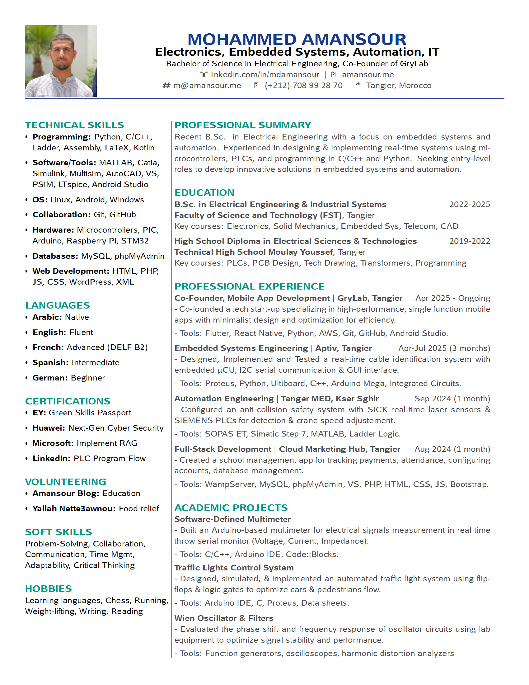

# ATS-Friendly Professional Resume in LaTeX

[](https://opensource.org/licenses/MIT)

This repository contains a clean, professional, and ATS-friendly resume template built using LaTeX. The design is minimalist, focusing on readability and structure to ensure compatibility with Applicant Tracking Systems (ATS) commonly used by employers. It avoids complex tables, graphics, or fonts that might cause parsing issues, while still providing a visually appealing PDF output.

The template is based on my personal resume as an Electrical Engineering graduate, but it's easily customizable for your own use. It includes sections for technical skills, languages, certifications, professional summary, education, experience, and projects.

## Preview

Here's a rendered preview of the resume (from `Resume.pdf`):



View the full PDF [here](https://mdamansour.github.io/Resume/Resume.pdf).

## Features

- **ATS-Friendly**: Simple layout with standard fonts (Helvetica), no columns that could break ATS parsing, and semantic structure for easy keyword extraction.
- **Modern Design**: Uses color accents for headers, icons from Font Awesome, and hyperlinks without visible underlines.
- **Customizable**: Easily edit sections, add/remove content, or swap in your profile photo.
- **LaTeX-Based**: Compiles to a high-quality PDF with precise typography.
- **Sections Included**:
  - Contact Information
  - Technical Skills
  - Languages
  - Certifications
  - Volunteering
  - Soft Skills
  - Hobbies
  - Professional Summary
  - Education
  - Professional Experience (Internships)
  - Academic Projects

## Requirements

To compile the LaTeX file, you'll need:
- A LaTeX distribution (e.g., TeX Live, MiKTeX, or Overleaf online editor).
- Packages: geometry, enumitem, multicol, parskip, xcolor, fontenc, helvet, graphicx, hyperref, fontawesome5 (most are standard; install via your LaTeX manager if missing).
- Optional: A profile image named `profile.jpg` (placed in the same directory).

## How to Use

1. **Clone the Repository**:
   ```
   git clone https://github.com/mdamansour/Resume.git
   cd Resume
   ```

2. **Customize the Content**:
   - Open `Resume.tex` in your favorite text editor or LaTeX IDE.
   - Update personal details, sections, and content as needed.
   - Replace `profile.jpg` with your own photo (ensure it's square and appropriately sized).

3. **Compile to PDF**:
   - Run the following command (using pdflatex):
     ```
     pdflatex Resume.tex
     ```
   - Or upload to Overleaf for online compilation.
   - The output will be `Resume.pdf`.

4. **Tips for ATS Optimization**:
   - Use standard keywords from job descriptions in your content.
   - Avoid headers/footers, as they might not parse well.
   - Test your PDF with an ATS simulator tool online.

## Customization Guide

- **Colors**: Defined at the top (e.g., `headerblue`, `sectionteal`). Adjust RGB values to match your preference.
- **Fonts**: Uses sans-serif (Helvetica) by default for modernity. Change via `\usepackage` if needed.
- **Adding Sections**: Simply add new minipages or itemize environments.
- **Removing Photo**: Comment out the `\includegraphics` line if you prefer a text-only version.
- **Hyperlinks**: All links use `hidelinks` to avoid blue boxes; ensure URLs are correct.

If you encounter compilation errors, check for missing packages or syntax issues.

## License

This project is licensed under the MIT License - see the [LICENSE](LICENSE) file for details.

## Contact

- **LinkedIn**: [linkedin.com/in/mdamansour](https://linkedin.com/in/mdamansour)
- **Website**: [amansour.me](https://amansour.me)
- **Email**: [m@amansour.me](mailto:m@amansour.me)

Feel free to fork this repository and adapt it for your needs. If you find it useful, star the repo or reach out with feedback! 🚀
